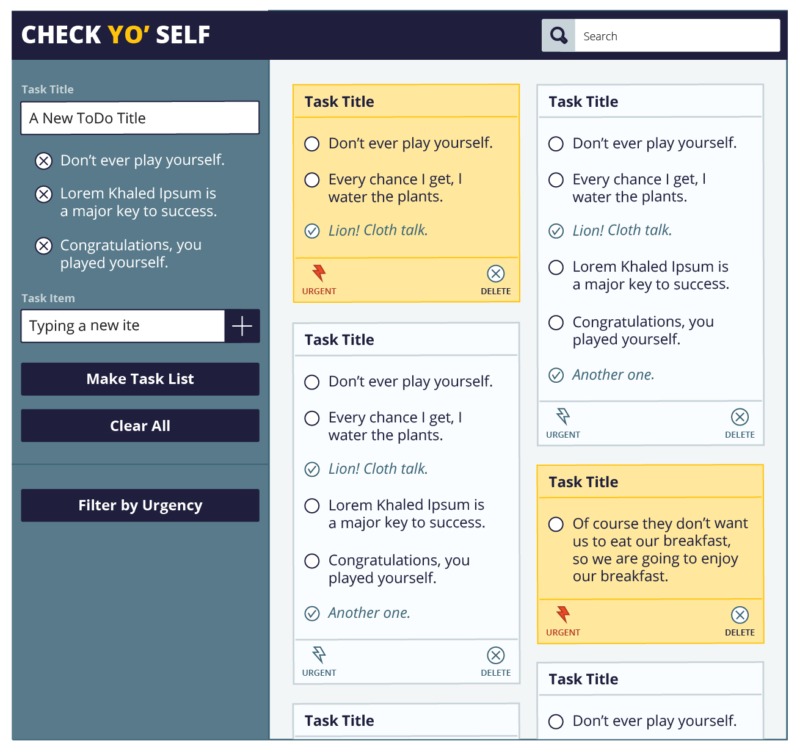

# Check-yo-self
## Written and Remixed by: Nick Sandwich Boiz (Nick D, Nick N, and Dustin)

#### A little bit about the project: You've got stuff to do? Well, use our app. It's dope.

###Things that you can do:

* Dope Sh****
* But really, dope sh****
* Start on the left hand side, and create a title for your new 'To-Do List'
* Add as many tasks as you want on the left side bar (and hit the plus button)
* Once you're created all the contents of your To-Do List, add it to the right side with the 'Make Task List' button
* Feel free to check off tasks as you complete them and mark them as 'Urgent'
* Make sure you complete all of your tasks before deleting the To-Do List (you can't delete it unless you do)

###Overall Wins:

*We entered as individuals, and now we are all one. 
*Our ability to white board and think problems through was REALLY successful
*We planned a lot on the front end which was great and allowed us to set up our code in a way that made it easier to move through iterations as the project became more complex
*Our communication as a team was great and everyone felt in the loop at most times
*We're all proud of our project and the work that we did

###Challenges:

*There were some obstacles that we had to encounter throughout the project - these included reinstantiating objects, creating the tasks array without making it global, and updating local storage
*With more time, we would have liked to work through iteration 3 and 4 to add use-ability and more features
*There are some bugs with checking tasks on and off and if multiple tasks within a To-Do List are named the same thing. This is because we search for tasks by the 'name' property
*The next thing we'd like to work on is sorting by urgency and having the correct cards appear

Here's the comp that we went off of:

Here's what the screen shot looks like:

Here's what the mobile screen shot looks like: 

